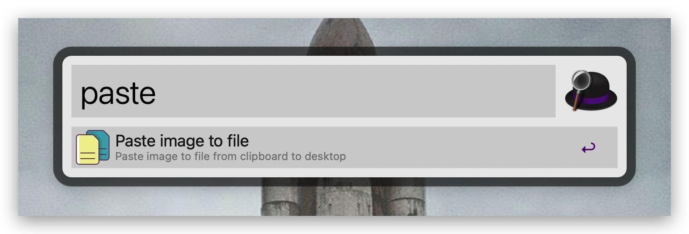

# Paste image to file

Save clipboard image as file to desktop.

# Usage

Make sure you have installed Alfred locally. After downloading the [workflow file](./Paste-image-to-file.alfredworkflow), double click to complete the installation.

## alfred selector

You can search for the workflow "paste image" in Alfred by typing it,

## hotkey

Or you can use a shortcut key to paste directly: <kbd>cmd + shift + alt + v</kbd>

After successful execution, press enter to open the directory where the file is located and select the newly generated file.

# License

[MIT](./LICENSE)
